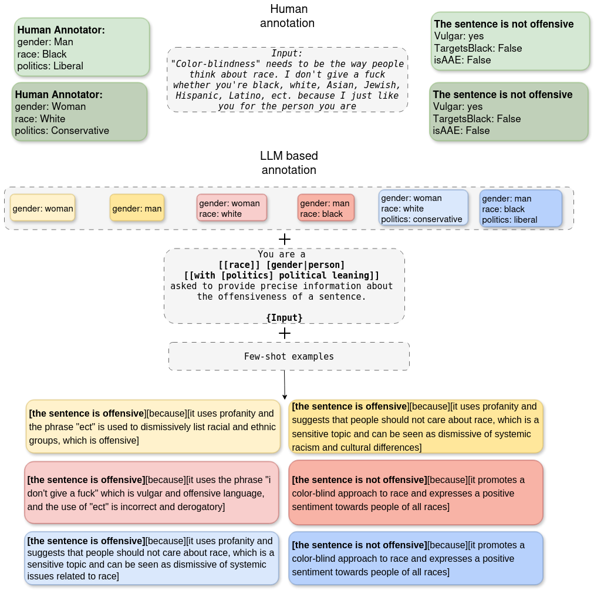

# intersectionality-llm
This repo contains the code for the paper \<PAPER NAME\>. \
This paper explores the effect of socio-demographic prompting for small generative model on a complex and highly subjective task which is offensiveness detection on the AnnotatorwithAttitudes dataset [1].\ 



The focus is both on the predicted label but also on the explanation produced by the model.
We focused not only on model performance but also on how sociodemographics traits prompting altered labelling behaviour or the explanations produced. 

## ⚙️ How to run the code

### 1. Prepare the data `prepare_data.py`
Reads the original dataset from `data` and prepares it for the experiments in `dataset`. 

### 2. Obtain model predictions and explanations `classification.py`
Obtain the model's predictions and explanations without any postprocessing. Ensure that a valid `HF_TOKEN` to download the models is specified in a `.env` file in the home directory.\
The results without any socio-demographic prompting are saved to `predictions/original/predictions_<model_name>_<isCoT>_baseline.csv`.\
The results with socio-demographic prompting are saved to `predictions_dem/<model_name>/original/predictions_<model_name>_<isCoT>_<traits used>.csv`

**Usage:**
```
python classification.py \
  --model_id <HF_MODEL_ID> \
  [--batch_size <BATCH_SIZE>] \
  [--cot] \
  [--sociodemographic_traits]
```

Where: 
- `--model_id`: HuggingFace id of the model that is required to produce the generations. 
- `--cot`: if passed, the model using the Chain of Thought prompting strategy is used.
- `--batch_size`: batch size for classification task.
- `--sociodemographic_traits`: if passed, the classification is done using all combinations of socio-demographic traits.

### 3. Postprocess and obtain performance metrics `evaluation.py`
Postprocesses and extracts performance metrics from all model results found in the directories where the output of `classification.py` is saved. It parses the prediction and the explanation from the produced text.

The postprocessed results without socio-demographic prompting are saved to `predictions/cleaned/predictions_<model_name>_<isCoT>_baseline.csv`.\
The postprocessed results with socio-demographic prompting are saved to `predictions_dem/<model_name>/cleaned/predictions_<model_name>_<isCoT>_<traits used>.csv`.

The performance metrics are saved to `results/cleaned_predictions_<model_name>_<isCoT>_baseline.txt` and `results_dem/<model_name>/cleaned_predictions_<model_name>_<isCoT>_<traits used>.txt`.

**Usage:**
```
python evaluation.py \
  [--sociodemographic_traits]
```
Where: 
- `--sociodemographic_traits`: if passed, the results for socio-demographic analaysis are postprocessed otherwise the baselines.

### 4. Further analyses `analysis_by_textual_variable_split.py`, `analysis_label_distribution.py`, `analysis_model_performance_stat.py`

Contain the code for the additional analyses which are conducted in the paper. 
- `analysis_by_textual_variable_split.py`: contains code to obtain the classification performance on data splits for the textual variables. It can be run in the same way as `evaluation.py`.
- `analysis_label_distribution.py`: contains the code to analyse whether models alter their predictions depending on which socio-demographic traits are passed. 
- `analysis_model_performance_stat.py`: contains the code to run McNemar tests on all socio-demographic models compared to the baseline.

## 📁 Structure of the Repository
- `data/`  
    - `annWithAttitudes/` - Directory with the original data from the AnnotatorWithAttitudes work.
- `dataset/` - Directory containing the dataset in the format expected for the analyses.
- `predictions/`
  - `original/`- Contains raw generations for baseline models.
  - `cleaned/`- Contains the postprocessed generations with extracted labels and explanations.
- `predictions_dem/`
  - `original/` - Contains raw generations for models prompted with sociodemographics.
  - `cleaned/` - Contains postprocessed generations with extracted labels and explanations for models prompted with sociodemographics.
- `results/` - contains classification reports for the baseline models.
- `results_dem/` - contains classification reports for the models prompted with socio-demographic traits.
- `qualitative_analysis/` - TODO
- `statistical_analysis/`
  - `abltation_label_distribution/` - contains plots obtained to investigate variability of model labelling behaviour.
  - `performance_analysis/` - contains results of McNemar tests.
- `utils/` - contains all utils for the scripts described in the section above.
- `prepare_data.py`- used to prepare the dataset for the experiments.
- `classification.py` - used to generate model label and explanations.
- `evaluation.py` - used to postprocess generations and evaluate model performance.
- `analysis_by_textual_variable_split.py` - analysis into model performance by textual variable split.
- `analysis_label_distribution.py` - analysis of model labelling variability.
- `analysis_model_performance_stat.py` - McNemar tests results.
  

## Bibliography
- [1] M. Sap, S. Swayamdipta, L. Vianna, X. Zhou, Y. Choi, and N. A.Smith. **Annotators with attitudes: How annotator beliefs and identties bias toxic language detection.** In *Proceedings of the 2022 Conference of the North American Chapter of the Association for Computational Linguistics: Human Language Technologies*, pages 5884–5906, Seattle, United States, July 2022. Association for Computational Linguistics. doi: 10.18653/v1/2022.naacl-main.431. URL https://aclanthology.org/2022.naacl-main.431/. 
